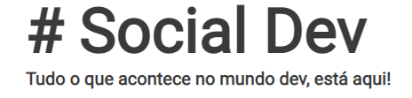

# Social-Dev
Link do deploy: https://social-dev-woad.vercel.app/login

# Como surgiu a ideia do projeto?

 Esse é um projeto que usei do site FrontEnd Mentor (https://www.frontendmentor.io/).

## Sobre o projeto

Este projeto e do curso Seja Dev Jornada Fullstack em que sou matriculado. A proposta e a realização de um protótipo de uma rede social baseada num CRUD.
O projeto tem a parte de cadastro de usuario, login, criação de post (somente texto), edição do post e exclusão do post.

### 01. Rodando o Projeto
Primeiramente va ao terminal do projeto e execute o comando "npm i" para instalar todas as dependencias de uma vez.
Para rodar o projeto, utilize o comando "npm run dev" no terminal  .
Voc

### 02. Dependencias/bibliotecas utilizadas

Inicializar um projeto Node: "npm init -y"

Instalação do Next, React e React DOM: "npm i next@12.0.7 react@17.0.2 react-dom@17.0.2"

Instalação do styled components: "npm i styled-components@5.3.3"

Instalação da biblioteca do babel: "npm i babel-plugin-styled-components@2.0.6 --save-dev"

React-hook-form: "npm i react-hook-form@7.27.1 @hookform/resolvers@2.8.8"

Instalação do Next Connect, Next Joi :  "npm i next-connect@0.12.2 next-joi@2.2.1 joi@17.6.0"

## Criado por

Criado por mim Fabio Diogo.

